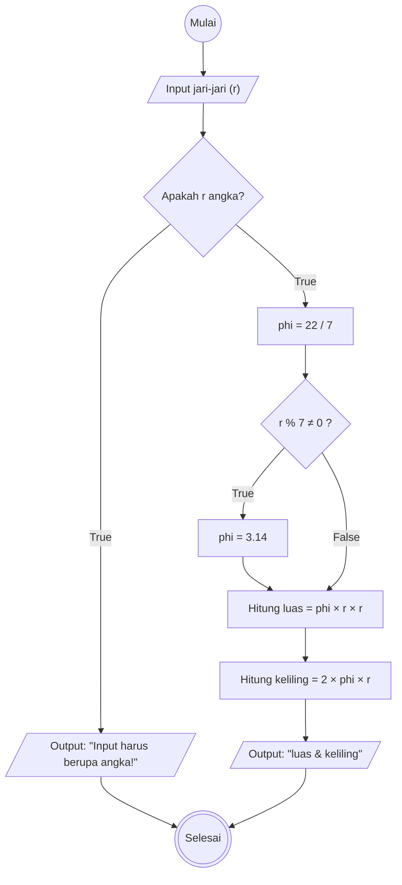

```mermaid
flowchart TD
A@{shape: circle, label: "Mulai"}
B@{shape: lean-r, label: "Input jari-jari (r)"}
C@{shape: diamond, label: "Apakah r angka?"}
D@{shape: lean-r, label: 'Output: "Input harus berupa angka!"'}
E@{shape: rectangle, label: "phi = 22 / 7"}
F@{shape: diamond, label: "r % 7 ≠ 0 ?"}
G@{shape: rectangle, label: "phi = 3.14"}
H@{shape: rectangle, label: "Hitung luas = phi × r × r"}
I@{shape: rectangle, label: "Hitung keliling = 2 × phi × r"}
J@{shape: lean-r, label: 'Output: "luas & keliling"'}
K@{shape: dbl-circ, label: "Selesai"}

A --> B
B --> C
C -- True --> D --> K
C -- True --> E
E --> F
F -- True --> G --> H
F -- False --> H
H --> I --> J --> K

```